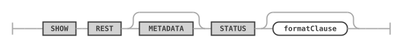
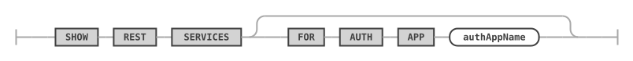
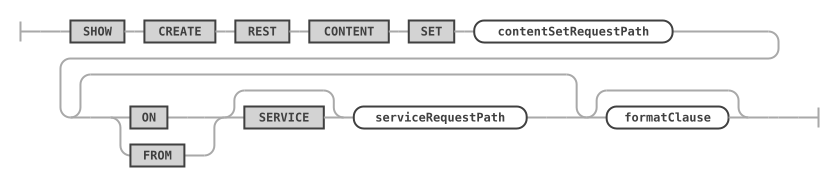
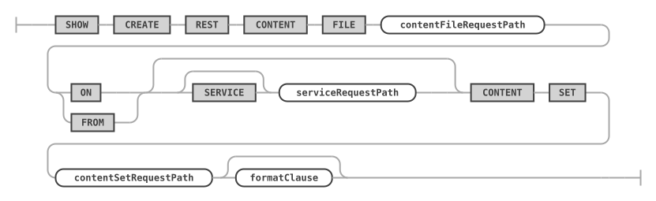
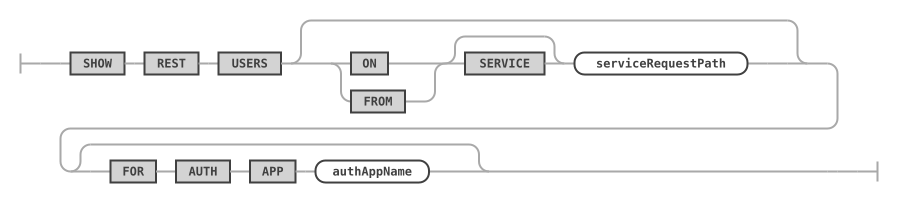
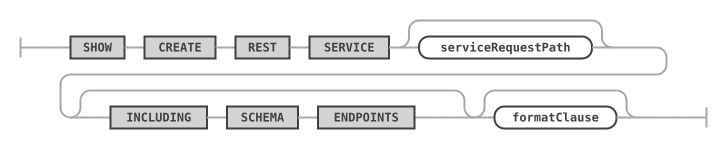
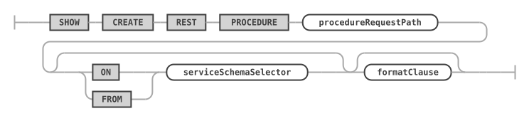
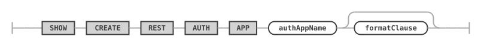
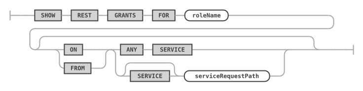

<!-- Copyright (c) 2022, 2025, Oracle and/or its affiliates.

This program is free software; you can redistribute it and/or modify
it under the terms of the GNU General Public License, version 2.0,
as published by the Free Software Foundation.

This program is designed to work with certain software (including
but not limited to OpenSSL) that is licensed under separate terms, as
designated in a particular file or component or in included license
documentation.  The authors of MySQL hereby grant you an additional
permission to link the program and your derivative works with the
separately licensed software that they have either included with
the program or referenced in the documentation.

This program is distributed in the hope that it will be useful,  but
WITHOUT ANY WARRANTY; without even the implied warranty of
MERCHANTABILITY or FITNESS FOR A PARTICULAR PURPOSE.  See
the GNU General Public License, version 2.0, for more details.

You should have received a copy of the GNU General Public License
along with this program; if not, write to the Free Software Foundation, Inc.,
51 Franklin St, Fifth Floor, Boston, MA 02110-1301 USA -->

# USE and SHOW

## USE

An existing REST service can be dropped by using the `DROP REST SERVICE` statement.

**_SYNTAX_**

```antlr
useStatement:
    USE REST serviceAndSchemaRequestPaths
;

serviceAndSchemaRequestPaths:
    SERVICE serviceRequestPath
    | serviceSchemaSelector
;
```

useStatement ::=


serviceAndSchemaRequestPaths ::=


**_Examples_**

The following example makes the REST service with the request path `/myService` the new default REST service.

```sql
USE REST SERVICE /myService;
```

After the default REST service has been set, the following statement can be used to set the default REST schema.

```sql
USE REST SCHEMA /sakila;
```

The next example shows how to set the default REST service and REST schema in a single statement.

```sql
USE REST SERVICE /myService SCHEMA /sakila;
```

## SHOW REST STATUS

The `SHOW REST STATUS` statement is used to get basic information about the current status of the MySQL REST Service.

**_SYNTAX_**

```antlr
showRestMetadataStatusStatement:
    SHOW REST METADATA? STATUS
;
```

showRestMetadataStatusStatement ::=


The result reports whether the metadata schema is configured and enabled, the number of enabled REST services, the current and the available version of the metadata schema and whether it can be updated.

The `metadata_version` column holds the id of the last entry in the metadata's audit log. It changes whenever the REST metadata changes, so a client can poll it and refresh its view of the REST services only when the value has changed.

**_Examples_**

The following example shows the status of the MariaDB REST Service.

```sql
SHOW REST STATUS;
```

## SHOW REST SERVICES

The `SHOW REST SERVICES` statement lists all available REST services. With `FOR AUTH APP`, only the REST services the given REST auth app is linked to are listed.

**_SYNTAX_**

```antlr
showRestServicesStatement:
    SHOW REST SERVICES (
        FOR AUTH APP authAppName
    )?
;
```

showRestServicesStatement ::=


**_Examples_**

The following example lists all REST services.

```sql
SHOW REST SERVICES;
```

The following example lists the REST services the REST auth app `MRS` is linked to.

```sql
SHOW REST SERVICES FOR AUTH APP "MRS";
```

## SHOW REST SCHEMAS

The `SHOW REST SCHEMAS` statement lists all available REST schemas of the given or current REST service.

**_SYNTAX_**

```antlr
showRestSchemasStatement:
    SHOW REST SCHEMAS (
        (ON | FROM) SERVICE? serviceRequestPath
    )?
;
```

showRestSchemasStatement ::=


**_Examples_**

The following example lists all REST schemas of the REST service using the request path `/myService`.

```sql
SHOW REST SERVICES FROM /myService;
```

## SHOW REST VIEWS

The `SHOW REST DATA MAPPING VIEWS` statement lists all available REST data mapping views of the given or current REST schema.

**_SYNTAX_**

```antlr
showRestViewsStatement:
    SHOW REST DATA? MAPPING? VIEWS (
        (ON | FROM) serviceSchemaSelector
    )?
;

serviceSchemaSelector:
    (SERVICE serviceRequestPath)? SCHEMA schemaRequestPath
;
```

showRestViewsStatement ::=


serviceSchemaSelector ::=


**_Examples_**

The following example lists all REST data mapping views of the given REST schema.

```sql
SHOW REST VIEWS FROM SERVICE /myService SCHEMA /sakila;
```

## SHOW REST PROCEDURES

The `SHOW REST PROCEDURES` statement lists all available REST procedures of the given or current REST schema.

**_SYNTAX_**

```antlr
showRestProceduresStatement:
    SHOW REST PROCEDURES (
        (ON | FROM) serviceSchemaSelector
    )?
;

serviceSchemaSelector:
    (SERVICE serviceRequestPath)? SCHEMA schemaRequestPath
;
```

showRestProceduresStatement ::=


serviceSchemaSelector ::=


## SHOW REST FUNCTIONS

The `SHOW REST FUNCTIONS` statement lists all available REST functions of the given or current REST schema.

**_SYNTAX_**

```antlr
showRestFunctionsStatement:
    SHOW REST FUNCTIONS (
        (ON | FROM) serviceSchemaSelector
    )?
;

serviceSchemaSelector:
    (SERVICE serviceRequestPath)? SCHEMA schemaRequestPath
;
```

showRestFunctionsStatement ::=


serviceSchemaSelector ::=


**_Examples_**

The following example lists all REST procedures of the given REST schema.

```sql
SHOW REST PROCEDURES FROM SERVICE /myService SCHEMA /sakila;
```

## SHOW REST CONTENT SETS

The `SHOW REST CONTENT SETS` statement lists all available REST content sets of the given or current REST service.

**_SYNTAX_**

```antlr
showRestContentSetsStatement:
    SHOW REST CONTENT SETS (
        (ON | FROM) SERVICE? serviceRequestPath
    )?
;
```

showRestContentSetsStatement ::=


**_Examples_**

The following example lists all REST content sets of the given REST service.

```sql
SHOW REST CONTENT SETS FROM SERVICE /myService;
```

## SHOW REST CONTENT FILES

The `SHOW REST CONTENT SETS` statement lists all available REST content files of the given content set.

**_SYNTAX_**

```antlr
showRestContentFilesStatement:
    SHOW REST CONTENT FILES (
        ON
        | FROM
    ) (SERVICE? serviceRequestPath)? CONTENT SET contentSetRequestPath
;
```

showRestContentFilesStatement ::=


## SHOW CREATE REST CONTENT SET

Shows the CREATE SQL statement corresponding to the given content set.

**_SYNTAX_**

```antlr
showCreateRestContentSetStatement:
    SHOW CREATE REST CONTENT SET contentSetRequestPath (
        (ON | FROM) SERVICE? serviceRequestPath
    )? formatClause?
;
```

showCreateRestContentSetStatement ::=


## SHOW CREATE REST CONTENT FILE

Shows the CREATE SQL statement corresponding to the given content file.

**_SYNTAX_**

```antlr
showCreateRestContentFileStatement:
    SHOW CREATE REST CONTENT FILE contentFileRequestPath (
        ON
        | FROM
    ) (SERVICE? serviceRequestPath)? CONTENT SET contentSetRequestPath formatClause?
;
```

showCreateRestContentFileStatement ::=


## SHOW REST AUTH APPS

The `SHOW REST AUTH APPS` statement lists all available REST auth apps of the given or current REST service.

**_SYNTAX_**

```antlr
showRestAuthAppsStatement:
    SHOW REST AUTH APPS (
        (ON | FROM) SERVICE? serviceRequestPath
    )?
;
```

showRestAuthAppsStatement ::=


**_Examples_**

The following example lists all REST auth apps of the given REST service.

```sql
SHOW REST AUTH APPS FROM SERVICE /myService;
```

## SHOW REST AUTH VENDORS

The `SHOW REST AUTH VENDORS` statement lists the vendors a REST auth app can be created for, e.g. `MRS`, `MySQL Internal` or an OAuth2 vendor. The vendor is given by the `VENDOR` clause of the `CREATE REST AUTH APP` statement.

**_SYNTAX_**

```antlr
showRestAuthVendorsStatement:
    SHOW REST AUTH VENDORS
;
```

showRestAuthVendorsStatement ::=


**_Examples_**

The following example lists all REST auth vendors.

```sql
SHOW REST AUTH VENDORS;
```

## SHOW REST USERS

The `SHOW REST USERS` statement lists REST user accounts. With a REST service, the users of the REST auth apps linked to that service are listed. With `FOR AUTH APP`, the users of the given REST auth app are listed. Both can be combined.

When neither is given, the users of the current REST service are listed, or all users if no current REST service is set. When only `FOR AUTH APP` is given, the current REST service is not taken into account.

Passwords are never shown.

**_SYNTAX_**

```antlr
showRestUsersStatement:
    SHOW REST USERS (
        (ON | FROM) SERVICE? serviceRequestPath
    )? (FOR AUTH APP authAppName)?
;
```

showRestUsersStatement ::=


**_Examples_**

The following example lists the users of all REST auth apps linked to the REST service `/myService`.

```sql
SHOW REST USERS ON SERVICE /myService;
```

The following example lists the users of the REST auth app `MRS`.

```sql
SHOW REST USERS FOR AUTH APP "MRS";
```

## SHOW REST COLUMNS

The `SHOW REST COLUMNS` statement lists what a REST object can expose from a database object. For a table or a view, these are its columns and its references to and from other tables (its foreign keys in both directions), which can be added to the data mapping of a REST view. For a procedure or a function, these are its parameters and, for a function, its return type.

The object type is optional; without it, the type is detected. Without a schema name, the database schema of the current REST schema is used, or the current database of the session.

**_SYNTAX_**

```antlr
showRestColumnsStatement:
    SHOW REST COLUMNS (FROM | IN) (
        TABLE
        | VIEW
        | PROCEDURE
        | FUNCTION
    )? qualifiedIdentifier formatClause?
;
```

showRestColumnsStatement ::=


The result has one row per column, reference or parameter, with the columns `position`, `name`, `kind`, `datatype`, `not_null`, `is_primary`, `id_generation` and `reference`:

- A column has the kind `COLUMN`.
- A reference has the kind `REFERENCE`. Its `reference` column describes it, e.g. `n:1 sakila.country (country_id = country_id)` for a reference to one row of another table, or `1:n sakila.address (city_id = city_id)` for a reference to many rows.
- A parameter has its mode as kind: `IN`, `OUT` or `INOUT`.
- The return value of a function has the kind `RETURN`.

With `FORMAT=JSON`, the result is a single JSON document. For a table or a view, it holds the `columns` with their `db_column` and `reference_mapping` documents, the same documents that the data mapping of a REST view stores. For a procedure or a function, it holds the `parameters` and the `return_type`.

**_Examples_**

The following example lists the columns and references of the `sakila.city` table.

```sql
SHOW REST COLUMNS FROM sakila.city;
```

The following example returns the parameters of the `film_in_stock` procedure as a JSON document.

```sql
SHOW REST COLUMNS FROM PROCEDURE sakila.film_in_stock FORMAT=JSON;
```

## SHOW CREATE ... FORMAT=JSON

Every `SHOW CREATE REST` statement ends with an optional `FORMAT` clause, as the `EXPLAIN` statement of the MariaDB server does. `FORMAT=TRADITIONAL`, the default, returns the statement that creates the REST object. `FORMAT=JSON` returns a JSON document of the REST object instead, for tools that work with the REST objects, e.g. an editor for the data mapping of a REST view.

**_SYNTAX_**

```antlr
formatClause:
    FORMAT EQUAL_OPERATOR (JSON | textOrIdentifier)
;
```

formatClause ::=


The format name can be written in any case and in quotes, e.g. `FORMAT=JSON`, `FORMAT = json` or `FORMAT='json'`.

The JSON document holds the values of the REST object as the REST metadata stores them, with the column names as keys. Ids are UUID strings, and option documents are embedded as JSON. In addition:

- A REST service lists the names of its REST auth apps. With `INCLUDING DATABASE ENDPOINTS`, it holds its REST schemas, each with its REST objects.
- A REST view, procedure or function holds its data mapping as `objects`, each with its `fields`. A field that represents a reference to another table holds it as `object_reference`, and the fields below the reference point to it with their `parent_reference_id`. Columns that are not part of the data mapping are stored as disabled fields.
- A REST auth app lists the REST services it is linked to. Its app secret is never returned; `has_app_secret` tells whether one is set.
- A REST user lists the REST roles granted to it. Its password is never returned; `has_password` tells whether one is set.
- A REST role lists its privileges.
- A REST content file holds its size, not its content.

**_Examples_**

The following example returns the REST view `/city` with its data mapping as a JSON document.

```sql
SHOW CREATE REST VIEW /city ON SERVICE /myService SCHEMA /sakila FORMAT=JSON;
```

## SHOW CREATE REST SERVICE

The `SHOW CREATE REST SERVICE` statement shows the corresponding DDL statement for the given REST service.

**_SYNTAX_**

```antlr
showCreateRestServiceStatement:
    SHOW CREATE REST SERVICE serviceRequestPath? (
        INCLUDING SCHEMA ENDPOINTS
    )? formatClause?
;
```

showCreateRestServiceStatement ::=


**_Examples_**

The following example shows the DDL statement for the REST service with request path `/myService`.

```sql
SHOW CREATE REST SERVICE /myService;
```

## SHOW CREATE REST SCHEMA

The `SHOW CREATE REST SCHEMA` statement shows the corresponding DDL statement for the given REST schema.

**_SYNTAX_**

```antlr
showCreateRestSchemaStatement:
    SHOW CREATE REST SCHEMA schemaRequestPath? (
        (ON | FROM) SERVICE? serviceRequestPath
    )? formatClause?
;
```

showCreateRestSchemaStatement ::=


**_Examples_**

The following example shows the DDL statement for the given REST schema.

```sql
SHOW CREATE REST SCHEMA /sakila FROM /myService;
```

## SHOW CREATE REST VIEW

The `SHOW CREATE REST DATA MAPPING VIEW` statement shows the corresponding DDL statement for the given REST data mapping view.

**_SYNTAX_**

```antlr
showCreateRestViewStatement:
    SHOW CREATE REST DATA? MAPPING? VIEW viewRequestPath (
        (ON | FROM) serviceSchemaSelector
    )? formatClause?
;

serviceSchemaSelector:
    (SERVICE serviceRequestPath)? SCHEMA schemaRequestPath
;
```

showCreateRestViewStatement ::=


serviceSchemaSelector ::=


**_Examples_**

The following example shows the DDL statement for the given REST data mapping view.

```sql
SHOW CREATE REST VIEW /city ON SERVICE /myService SCHEMA /sakila;
```

## SHOW CREATE REST PROCEDURE

The `SHOW CREATE REST PROCEDURE` statement shows the corresponding DDL statement for the given REST procedure.

**_SYNTAX_**

```antlr
showCreateRestProcedureStatement:
    SHOW CREATE REST PROCEDURE procedureRequestPath (
        (ON | FROM) serviceSchemaSelector
    )? formatClause?
;

serviceSchemaSelector:
    (SERVICE serviceRequestPath)? SCHEMA schemaRequestPath
;
```

showCreateRestProcedureStatement ::=


serviceSchemaSelector ::=


## SHOW CREATE REST FUNCTION

The `SHOW CREATE REST FUNCTION` statement shows the corresponding DDL statement for the given REST function.

**_SYNTAX_**

```antlr
showCreateRestFunctionStatement:
    SHOW CREATE REST FUNCTION functionRequestPath (
        (ON | FROM) serviceSchemaSelector
    )? formatClause?
;

serviceSchemaSelector:
    (SERVICE serviceRequestPath)? SCHEMA schemaRequestPath
;
```

showCreateRestFunctionStatement ::=


serviceSchemaSelector ::=


**_Examples_**

The following example shows the DDL statement for the given REST procedure.

```sql
SHOW CREATE REST PROCEDURE /inventory_in_stock ON SERVICE /myService SCHEMA /sakila;
```

## SHOW CREATE REST AUTH APP

The `SHOW CREATE REST AUTH APP` statement shows the corresponding DDL statement for the given REST auth app.

**_SYNTAX_**

```antlr
showCreateRestAuthAppStatement:
    SHOW CREATE REST AUTH APP authAppName formatClause?
;
```

showCreateRestAuthAppStatement ::=


**_Examples_**

The following example shows the DDL statement for the given REST auth app.

```sql
SHOW CREATE REST AUTH APP "MRS" FROM SERVICE /myTestService;
```

## SHOW CREATE REST ROLE

The `SHOW CREATE REST ROLE` statement shows the corresponding DDL statement for the given REST role.

**_SYNTAX_**

```antlr
showCreateRestRoleStatement:
    SHOW CREATE REST ROLE roleName roleService? formatClause?
;

roleService:
    ON (
        ANY SERVICE
        | SERVICE? serviceRequestPath
    )
;
```

showCreateRestRoleStatement ::=


roleService ::=


**_Examples_**

The following example shows the DDL statement for the given REST auth app.

```sql
SHOW CREATE REST ROLE `myrole` ON SERVICE /myTestService;
```

## SHOW CREATE REST USER

The `SHOW CREATE REST USER` statement shows the corresponding DDL statement for the given REST user account.

**_SYNTAX_**

```antlr
showCreateRestUserStatement:
    SHOW CREATE REST USER userName AT_SIGN authAppName formatClause?
;
```

showCreateRestUserStatement ::=


**_Examples_**

The following example shows the DDL statement for the given REST auth app.

```sql
SHOW CREATE REST USER myuser@`MRS` ON SERVICE /myTestService;
```

## SHOW REST ROLES

Shows a list of roles, optionally filtered by service or auth app and users that were granted the role.

**_SYNTAX_**

```antlr
showRestRolesStatement:
    SHOW REST ROLES (
        (ON | FROM) (
            ANY SERVICE
            | SERVICE? serviceRequestPath
        )
    )? (FOR userName? AT_SIGN authAppName)?
;
```

showRestRolesStatement ::=


## SHOW REST GRANTS

Show the list of REST privileges that were granted to the given role.

**_SYNTAX_**

```antlr
showRestGrantsStatement:
    SHOW REST GRANTS FOR roleName (
        (ON | FROM) (
            ANY SERVICE
            | SERVICE? serviceRequestPath
        )
    )?
;
```

showRestGrantsStatement ::=

